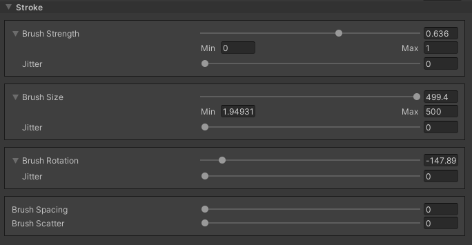

# Common Brush controls and shortcut keys

## Scene view hotkeys

In the Scene view, use the following hotkeys while moving the mouse horizontally to quickly adjust common Brush settings. Use the [Shortcuts Manager](https://docs.unity3d.com/Manual/ShortcutsManager.html) to remap hotkeys, if needed.

| **Shortcut** | **Function**                                                 |
| ------------ | ------------------------------------------------------------ |
| **A**        | Controls Brush strength (opacity).                           |
| **S**        | Controls Brush size.                                         |
| **D**        | Controls Brush rotation.                                     |
| **F**        | If you press F while the cursor is over a Terrain tile, the Scene view focuses on the area where you position the cursor.                               |
| **Control**  | Inverts the Brush effect for most Brushes; acts as a modifier for others. |
| **Shift**    | Temporarily enables the smoothing Brush.                     |
| **Shift + A**    | Enables the Terrain Layer Eyedropper tool.               |

For information about other built-in Terrain keyboard shortcuts, see [Creating and editing Terrains](https://docs.unity3d.com/Manual/terrain-UsingTerrains.html).

## Common Brush controls

All Brushes share some common settings, which are outlined below.

| **Property**       | **Function**             |                                                              |
| ------------------ | ------------------------ | ------------------------------------------------------------ |
| **Brush Strength** |                          | Controls the opacity (strength) of the Brush stroke.         |
|                    | *Jitter*                 | Randomizes the opacity (strength) of each Brush stroke.      |
| **Brush Size**     |                          | Controls the radius of the Brush stroke.                     |
|                    | *Jitter*                 | Randomizes the radius of each Brush stroke.                  |
| **Brush Rotation** |                          | Controls the rotation angle of the Brush stroke.             |
|                    | *Jitter*                 | Randomizes the rotation angle for each Brush stroke.         |
|                    | *Rotation Follows Mouse* | Forces the Brush rotation angle to always align to the mouse's direction of travel. |
| **Brush Spacing**  |                          | Controls the distance between Brush strokes.                 |
| **Brush Scatter**  |                          | Controls the degree of randomized scattering of the Brush strokes. |

There are arrows next to the **Brush Strength**, **Brush Size**, and **Brush Rotation** sliders. Click on an arrow to display more options that allow you to set a minimum or maximum value for the respective slider. This helps to improve usability and precision.
