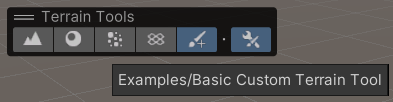
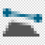
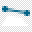
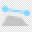

# Create your tool script

Create a new script in your project. Give the script the same file name and class name as the Terrain Tool you want to create. The basis for all Terrain tools is the [`TerrainPaintToolWithOverlays`](ScriptRef:TerrainPaintToolWithOverlays) class in the `UnityEditor.TerrainTools` namespace. [`TerrainPaintToolWithOverlays`](ScriptRef:TerrainPaintToolWithOverlays) is an abstract generic class.

You must override a few methods to make a functional tool. There are also two functions you must implement, and those are:

There are two functions that you must override create a tool; `GetName` and `GetDescription`.

| Function           | Returns                                                      |
|--------------------| ------------------------------------------------------------ |
| **GetName**        | `string` Name of the Terrain Tool. Appears in the tool UI.   |
| **GetDescription** | `string` Description for the Terrain Tool. Appears in the tool UI. |

Here is an example Terrain tool without any additional functionality.

```
using UnityEditor.TerrainTools;

class BasicTerrainTool : TerrainPaintToolWithOverlays<BasicTerrainTool>
{
    // Name of the Terrain Tool. This appears in the tool UI.
    public override string GetName()
    {
        return "Examples/Basic Custom Terrain Tool";
    }

    // Description for the Terrain Tool. This appears in the tool UI.
    public override string GetDescription()
    {
        return "This is a very basic Terrain Tool that doesn't do anything aside from appear in the list of Paint Terrain tools.";
    }
}
```

The example above is a good starting point to create a custom tool from scratch. **Basic Custom Terrain Tool** displays as an option in the **Paint Terrain** dropdown menu. On the terrain toolbar, a generic icon displays under **Custom Tools**.



## Inspector tool category

To specify a category in the dropdown menu, you can add categories and subcategories, such as `Category/SubCategory1/SubCategory2/Custom Terrain Tool`. Make sure to replace `Category`, `SubCategory1`, and `SubCategory2` with the category and subcategory names you want to use.

The image below displays **Examples**, which contains **Basic Custom Terrain Tool**.


## Toolbar icon and category

To access your tool from the terrain toolbar, give it an icon and a toolbar category. 

### Create icons

Icons for terrain tools have two states: on and off. These indicate whether you have selected the tool. Unity draws the background for the icon, so the icon must have a transparent background and renders on top.

In addition to on and off states, you can optionally provide a separate set of on and off icons for dark theme.

Icons must be at least 16x16, but look clearer on high DPI screens if you author them at 32x32. Icons can use any color scheme, but if you want them to fit in with the existing terrain tools, use the following color for the main shape:

| Icon State | Name           | Color   | Example                                              |
|------------|----------------|---------|------------------------------------------------------|
| Light Off | icon-off.png   | #555555 |  |
| Light On | icon-on.png    | #ffffff |    |
| Dark Off | d_icon-off.png | #c4c4c4 |   |
| Dark On | d_icon-on.png  | #c4c4c4 |    |

Dark theme icons must have the same name as their light mode counterparts but with a `d_` prefix.

**Note:** The terrain tools package uses the same icon for both on and off state in dark mode.

### Category
If you don't specify a category for the toolbar icon, it defaults to _CustomBrushes_'. However, you can choose from among the following five categories:

* Sculpt
* Materials
* Foliage
* NeighborTerrains
* CustomBrushes

To determine where in the list of tools your tool appears, you can define its _IconIndex_, which is a number that determines where in the list of icons it appears.

### Put it together

This code example specifies on and off icons (with file names relative to the root of the project folder), sets the category to _Sculpt_, and sets the _IconIndex_ to 100 to make it appear at the end of the list.

```
using UnityEditor.TerrainTools;

class BasicTerrainTool : TerrainPaintToolWithOverlays<BasicTerrainTool>
{
    // Name of the Terrain Tool. This appears in the tool UI.
    public override string GetName()
    {
        return "Examples/Basic Custom Terrain Tool";
    }

    // Description for the Terrain Tool. This appears in the tool UI.
    public override string GetDescription()
    {
        return "This is a very basic Terrain Tool that doesn't do anything aside from appear in the list of Paint Terrain tools.";
    }
    
    // File names of the light theme icons - prepend d_ to the file name to generate dark theme variants.
    // Override these to specify your own icon.
    // public override string OnIcon => "Assets/Icon_on.png";
    // public override string OffIcon => "Assets/Icon_off.png";

    // The toolbar category the icon appears under.
    public override TerrainCategory Category => TerrainCategory.CustomBrushes;

    // Where in the icon list the icon appears.
    public override int IconIndex => 100;
}
```