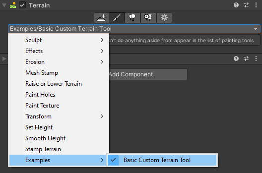

# Create your tool script

Create a new script in your project. Give the script the same file name and class name as the Terrain Tool you want to create. The basis for all Terrain tools is the `TerrainPaintTool` class in the `UnityEditor.TerrainTools` namespace. `TerrainPaintTool` is an abstract generic class.

You must override a few methods to make a functional tool.

There are two functions that you must override to create a tool; they are `GetName` and `GetDescription`:

| Function           | Returns                                                      |
|--------------------| ------------------------------------------------------------ |
| **GetName**        | `string` Name of the Terrain Tool. Appears in the tool UI.   |
| **GetDescription** | `string` Description for the Terrain Tool. Appears in the tool UI. |

Here is an example Terrain tool without any additional functionality.

```
using UnityEditor.TerrainTools;

class BasicTerrainTool : TerrainPaintTool<BasicTerrainTool>
{
    // Name of the Terrain Tool. This appears in the tool UI.
    public override string GetName()
    {
        return "Examples/Basic Custom Terrain Tool";
    }

    // Description for the Terrain Tool. This appears in the tool UI.
    public override string GetDescription()
    {
        return "This is a very basic Terrain Tool that doesn't do anything aside from appear in the list of Paint Terrain tools.";
    }
}
```

The example above is a good starting point to create a custom tool from scratch. **Basic Custom Terrain Tool** now displays as an option in the **Paint Terrain** dropdown menu.

If you want to specify a category in the dropdown menu, you can add categories and subcategories such as `Category/SubCategory1/SubCategory2/Custom Terrain Tool`. Make sure to replace `Category`, `SubCategory1`, and `SubCategory2` with the actual category and subcategory names you want to use.

The image below shows an **Examples** category, which contains the **Basic Custom Terrain Tool**.


