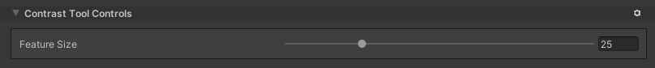

# Contrast Tool

Use the Contrast Tool to apply a contrast filter to the Terrain height.

Select a Terrain tile to bring up the Terrain Inspector. In the Terrain Inspector, click the **Paint Terrain** icon, and select **Effects** > **Contrast** from the list of Terrain tools.

## Parameters

| **Property**     | **Description**                                              |
| ---------------- | ------------------------------------------------------------ |
| **Feature Size** | Defines the scale at which the filter operates. Set this to a small value to enhance the contrast of small Terrain features, or set it to a high value to enhance the contrast of large Terrain features. |
