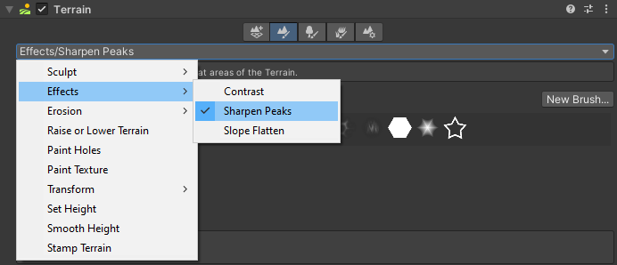

# Sharpen Peaks Tool

Use the Sharpen Peaks Tool to sharpen peaks and flatten flat areas of the Terrain.

Select a Terrain tile to bring up the Terrain Inspector. In the Terrain Inspector, click the **Paint Terrain** icon, and select **Effects** > **Sharpen Peaks** from the list of Terrain tools.

Alternatively, select the terrain, and select the sharpen peaks icon on the terrain toolbar.

## Parameters

| **Property**  | **Description**                                              |
| ------------- | ------------------------------------------------------------ |
| **Sharpness** | Controls the sharpness of peaks on a scale of 0 to 1. Values close to 1 make peaks sharper, and values closer to 0 flatten areas. |
