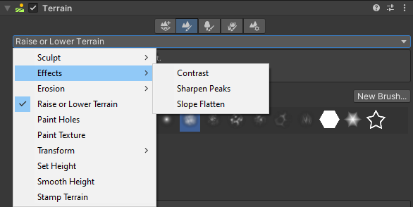

# Effects

**Effects** is a suite of tools that modifies the Terrain based on its existing height. **Effects** contains three tools:

* [__Contrast__](effects-contrast.md) expands or shrinks the overall range of the Terrain height.
* [__Sharpen Peaks__](effects-sharpen-peaks.md) sharpens peaks and flattens flat areas of the Terrain.
* [__Slope Flatten__](effects-slope-flatten.md) flattens the Terrain while maintaining the average slope.
