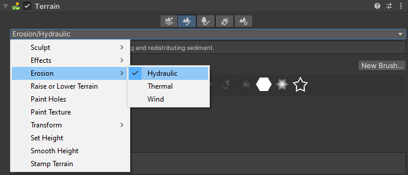
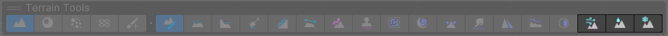

# Erosion

From the Inspector:

From the toolbar:

**Erosion** is a suite of tools that performs the simulation of erosion on Terrain. **Erosion** contains three tools:

* [__Hydraulic__](erosion-hydraulic.md)simulates the effect of water flowing over the Terrain and the transport of sediment.
   
   
* [__Thermal__](erosion-thermal.md) simulates the effect of sediment settling on the Terrain while maintaining a natural slope.

    
* [__Wind__](erosion-wind.md) simulates the effect of wind transporting and redistributing sediment.

    

The erosion effect changes based on the Terrain size and heightmap resolution. For highly detailed erosion features, use a Terrain heightmap resolution of 1025 or greater.
