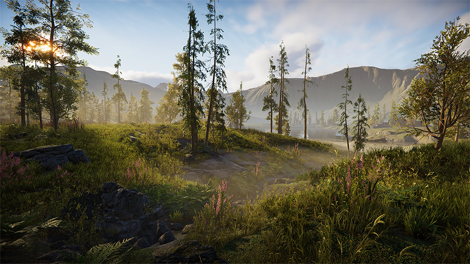

# Terrain Tools

The Terrain Tools package improves the workflow for creating Terrain ecosystems in Unity. You can download this package through the Package Manager in 2019.1 and newer versions of Unity. However, be aware that older versions of the package no longer receive bug fixes and feature maintenance. To work with an actively supported version of Terrain Tools, use Unity version 2021.2 or higher.

While Unity includes a built-in set of Terrain features that provide basic tooling, the Terrain Tools package adds more advanced features such as erosion tools, sculpting tools, and Brush Mask Filters. It also contains the [Terrain Toolbox](terrain-toolbox.md), which lets you create new Terrain from preset files or imported heightmaps, batch change settings on multiple Terrain tiles, and import/export splatmaps and heightmaps.

This add-on toolset is suitable if you require more control over the appearance of your Terrain, and want to streamline Terrain workflows. It’s also useful when you want to make more complex-looking Terrain, or author Terrain Texture data in external digital content creation tools.

For more information, see [Getting started with Terrain Tools](getting-started-with-terrain-tools.md).

New to Unity Terrain? Check out the latest [blog post](https://blog.unity.com/games/experience-the-new-unity-terrain-demo-scenes-for-hdrp-and-urp), and download the [HDRP Terrain Demo Scene](https://u3d.as/2L6K) or the [URP Terrain Demo Scene](https://u3d.as/2L6J) from the Asset Store to explore. 