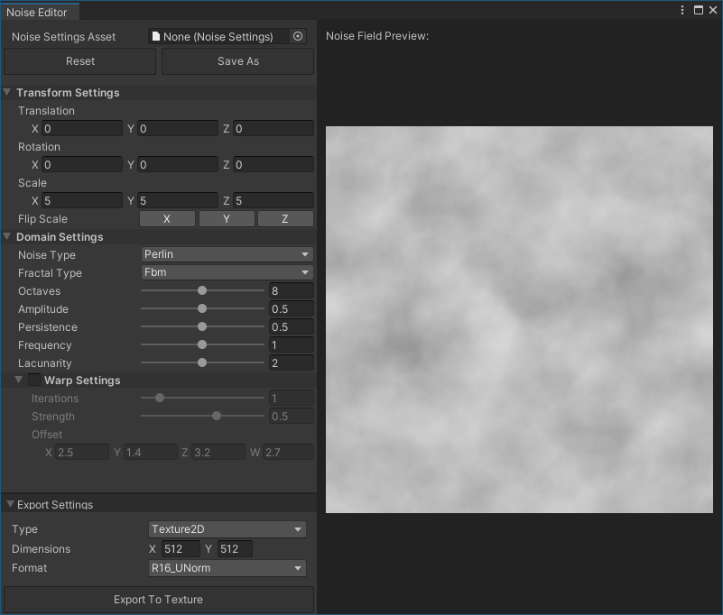

# Noise Editor

The **Noise Editor** allows you to author and manage Noise Settings Assets, which you can use in the [Noise Height Tool](sculpt-noise.md) and [Noise Brush Mask Filters](brush-mask-filters-list.md#noise). You can also use the Noise Editor to generate procedural textures.

To open the Noise Editor, select **Window** > **Terrain** > **Edit Noise** from the menu.

## Parameters

### Noise Settings Asset

[!include]

### Transform Settings

[!include]

### Domain Settings

[!include]

### Warp Settings

[!include]

### Export Noise to Texture

In the Noise Editor, **Export Noise to Texture** is located in the bottom left corner. It has options for exporting the noise to a Texture.

[!include]

### Noise Field Preview

[!include]