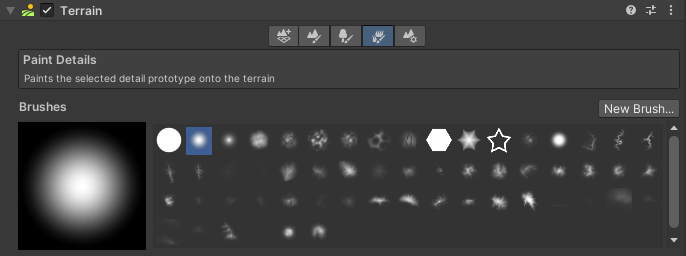
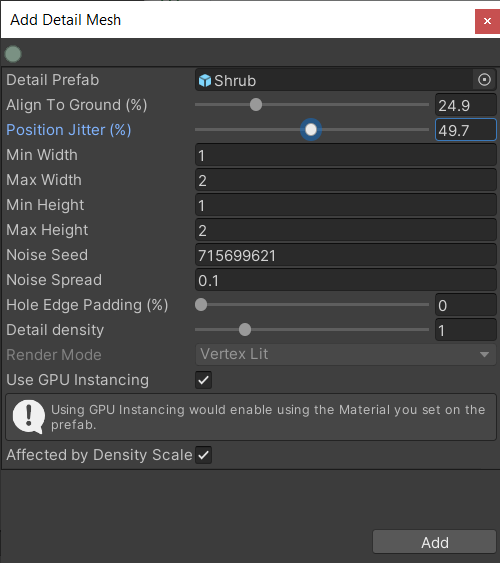
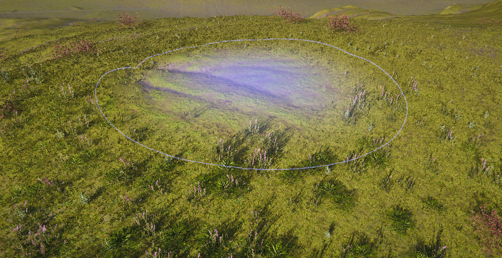
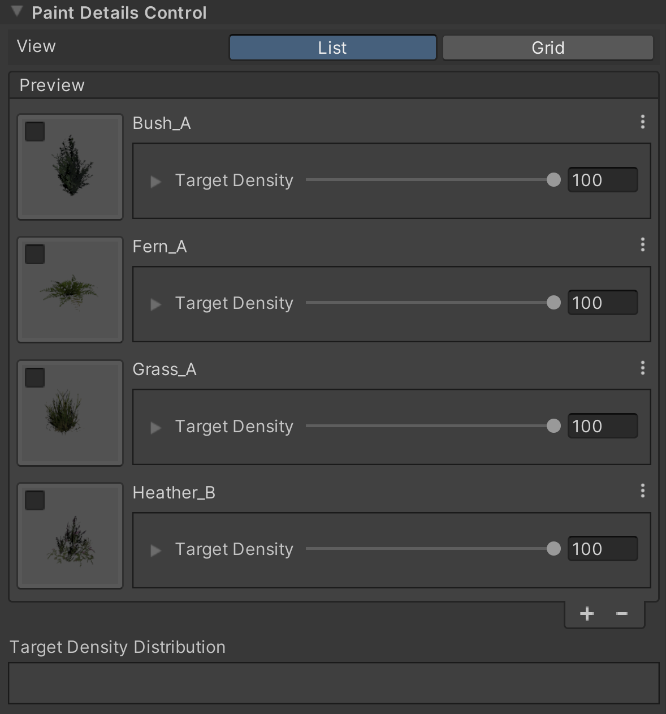
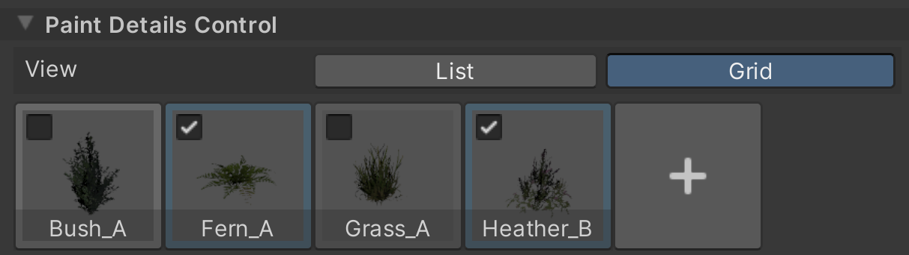
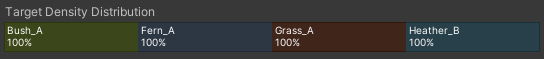
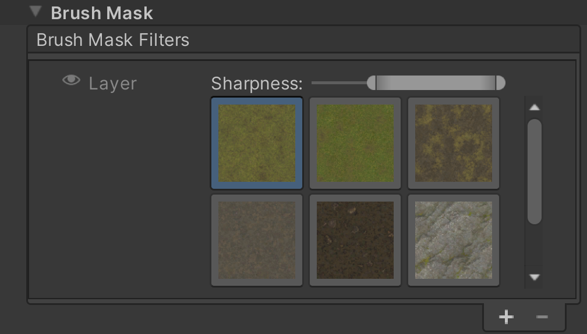

# Scatter Paint Details on the terrain

Use the **Paint Details** tool to scatter Details onto your Terrain. A Detail represents an instance of an object that you place on top of the terrain (such as rocks, grass, and bushes). 

**Note:** This tool overrides the built-in [Paint Details](https://docs.unity3d.com/Manual/terrain-Grass.html) and adds newer features, such as simultaneously scattering multiple details, filter masking terrain layers, and target coverage distribution UI.

## Select and configure the Paint Details tool

To select the Paint Details tool:
1. Select a Terrain tile to bring up the Terrain Inspector.
2. In the Terrain Inspector, click the Paint Details (grass) icon.

To configure the tool, add a new Detail to the Details Control. You can download preset details from the Asset Store, such as the free [Terrain Tools Sample Asset Pack](https://assetstore.unity.com/packages/2d/textures-materials/nature/terrain-tools-sample-asset-pack-145808).

## Add Details

To add a new Terrain Detail, do the following:

1. Go to the **Details Control** section.
1. Select the **Add (+)** button on either the list or grid view.
1. Select the type of detail you'd like to add. **Note:** HDRP only allows for the selection of Mesh Detail types.
1. Go to the **Add Detail** window.
1. Select a prefab.
1. Alter the detail settings.
1. Click **Add**.

## Modify Details

To modify a Detail, do the following:

1. Right-click on the detail thumbnail.
1. Click **Edit**.

 Alternatively, you can do the following:
 
 1. Go to the List view.
 1. Click the Detail's menu. 
 1. Click the dropdown menu to the left of the **Target Coverage** slider to expand the Detail.

## Remove Details

To remove a Detail, do the following:

1. right-click on the detail thumbnail.
1. Click **Remove**.

 Alternatively, you can do the following:
 
 1. Go to the List view.
 1. Select the Detail.
 1. Click **Add (-)**.

For more detailed information about Terrain Details, see [Grass and Other Details](https://docs.unity3d.com/Manual/terrain-Grass.html).

While painting Details, you can hold Shift and click to remove all details under the brush. Hold Ctrl and click to remove only the Details you select.

## View Details and their settings

With the View selection, you can choose a layout for the Detail selection UI. The two layout options are:

- The **Grid** view, which shows the Details in a compact grid view. Use this view to access a large list of Details.
- The **List** view, which shows the Details within a stack. Use this view to access each Detail's settings and **Target Density**.

To access the detail's settings within the **List** view, click the dropdown arrow to the left of the **Target Density** label.

To paint, do the following:

1. Click on the Detail's thumbnail to select it for painting.
1. Click and drag to paint the Details.

Select multiple Details to scatter them simultaneously. 

You can use the **Target Density Distribution** slider to gauge the distribution of selected Details' target density. You can also use the slider to adjust the **Target Density** from within the **Grid** view.
To modify a Detail's **Target Density**, click and drag the Detail's slider. 

## Control Detail location with the Layer Filter

In addition to the Paint Details tool, you can use the Brush Mask Filter to mask layers. Layer filtering gives finer control over the location of scattered Details. The filter works as a mask and keeps the Details from being scattered outside of the selected terrain layers.

To use the **Layer Filter**, do the following:
1. Add the filter to the **Filter Mask** list.
1. In the **Layer Filter** UI, select the terrain layer you'd like to scatter on.

