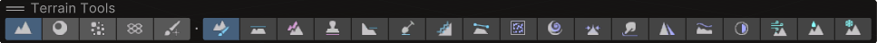
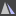

# Paint Terrain

**Paint Terrain** tools let you use a Brush to sculpt or paint the Terrain and make modifications. The Terrain Tools package adds 13 additional tools to the [6 built-in tools](https://docs.unity3d.com/Manual/terrain-Tools.html), and improves the functionality of the built-in [Paint Texture](https://docs.unity3d.com/Manual/terrain-PaintTexture.html), [Smooth Height](https://docs.unity3d.com/Manual/terrain-SmoothHeight.html), and [Stamp Terrain](https://docs.unity3d.com/Manual/terrain-StampTerrain.html) tools.

### Inspector
In the **Terrain Inspector**, click the **Paint Terrain** icon to display the list of Terrain tools.

### Scene View overlays

When you select a terrain, the terrain tools toolbar appears. The toolbar has two sections. You can use the first five icons to select the terrain tool category and use the rest to select the tools in that category.

To view the Paint Terrain tools, select the leftmost category icon that depicts a mountain:

## Tools

The Terrain Tools package provides the following 13 additional tools, as well as improved **Paint Texture**, **Smooth Height**, and **Stamp Terrain** functionality.

* [__Bridge__](sculpt-bridge.md) creates a Brush stroke between two selected points to build a land bridge.

  

* [__Clone__](sculpt-clone.md) duplicates Terrain from one region to another.

  

* [__Noise__](sculpt-noise.md) uses different noise types and fractal types to modify Terrain height.

  

* [__Terrace__](sculpt-terrace.md) transforms Terrain into a series of flat areas like steps.

  

* [__Contrast__](effects-contrast.md) expands or shrinks the overall range of the Terrain height.

  

* [__Sharpen Peaks__](effects-sharpen-peaks.md) sharpens peaks and flattens flat areas of the Terrain.

    
   
* [__Slope Flatten__](effects-slope-flatten.md) flattens the Terrain while maintaining the average slope.

    

* [__Hydraulic__](erosion-hydraulic.md) simulates the effect of water flowing over the Terrain and the transport of sediment.

    

* [__Thermal__](erosion-thermal.md) simulates the effect of sediment settling on the Terrain while maintaining a natural slope.

    

* [__Wind__](erosion-wind.md) simulates the effect of wind transporting and redistributing sediment.

    

* [__Paint Texture__](paint-texture.md) is similar to the built-in Paint Texture tool, but with added functionality such as an improved workflow and a Terrain Layer Eyedropper tool.

   

* [__Pinch__](transform-pinch.md) pulls the height towards or bulges it away from the center of the Brush.

    

* [__Smudge__](transform-smudge.md) moves Terrain features along the path of the Brush stroke.

    

* [__Twist__](transform-twist.md) rotates Terrain features around the center of the Brush, along the path of the Brush stroke.

    

* [__Smooth Height__](smooth-height.md) is similar to the built-in Smooth Height tool, but includes two new parameters, **Verticality** and **Blur Radius**, which provide finer control when smoothing your Terrain.

    

* [__Stamp Terrain__](stamp-terrain.md) is similar to the built-in Stamp Terrain tool, but with added functionality such as **Min** and **Max** operations that provide finer control over Terrain. It now also includes the Mesh Stamp tool, which projects the shape of a mesh into the Terrain's heightmap.

    

You can also create your own custom Terrain painting tools. For more information, see [TerrainTools.TerrainPaintTool_1](https://docs.unity3d.com/ScriptReference/TerrainTools.TerrainPaintTool_1.html) and [Create a custom Terrain tool](create-custom-tools.md).
