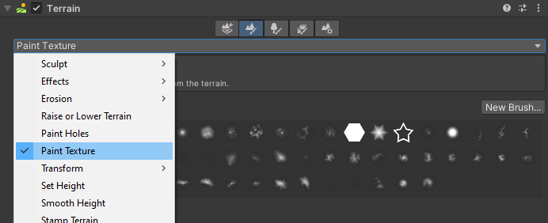
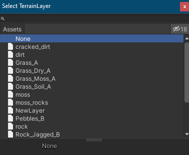
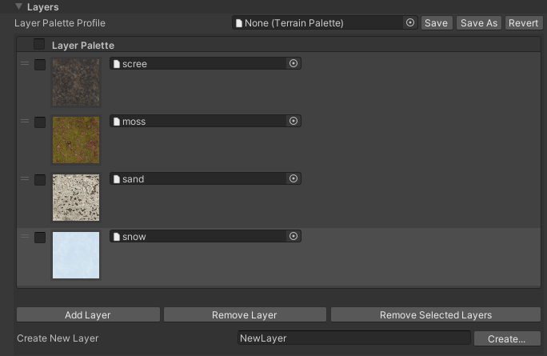

# Paint Texture

Use the **Paint Texture** tool to paint [Terrain Layers](https://docs.unity3d.com/Manual/class-TerrainLayer.html) onto your Terrain. A Terrain Layer represents a combination of textures and values that describe the surface of your Terrain (such as grass, snow, or sand).

**Note:** This tool overrides the built-in [Paint Texture](https://docs.unity3d.com/Manual/terrain-PaintTexture.html), and adds newer features such as the Terrain Layer Eyedropper tool, Terrain Layer selection UI, and Terrain Layer Palettes.

To select the Paint Texture tool:
1. Select a Terrain tile to bring up the Terrain Inspector.
2. In the Terrain Inspector, click the Paint Terrain (brush) icon.
3. Select Paint Texture from the drop-down menu.

To configure the tool, create a new Terrain Layer, or download an example from the Asset Store, such as the free [Terrain Tools Sample Asset Pack](https://assetstore.unity.com/packages/2d/textures-materials/nature/terrain-tools-sample-asset-pack-145808).

To create a new Terrain Layer, go to the **Layers** section, and type the name of your Layer in the **Create New Layer** field. Next, click the **Create** button next to the field, and select a Texture in the dialog to use it to create a new Layer.

To modify this newly created Terrain Layer, you must either select the Terrain Layer asset in your Project window, or expand the Terrain Layer Editor that appears in the Paint Texture tool UI. If you select **Add Layer**, you can add an existing Terrain Layer to your Terrain. You can also use the object picker (circle icon) next to each layer name in the **Layer Palette** to change the assigned Terrain Layer. These actions open a dialog box that lets you select a Terrain Layer, as shown below.

For more detailed information about Terrain Layers, see [Terrain Layers](https://docs.unity3d.com/Manual/class-TerrainLayer.html).

The Terrain Layer Eyedropper tool lets you select a Terrain Layer directly from the Terrain. To use the Eyedropper tool, hold down **Shift + A**, and click on an area of the Terrain to select its Terrain Layer. See[ Common Brush controls and shortcut keys](brush-controls-shortcut-keys.md) for more information about shortcut keys.

## Layers

The **Layer Palette Profile** lets you save and load Terrain Layer Palettes using a preset asset file. This allows you to recreate the same Layer Palette from a prior one, and you can share preset files with other team members to expedite Terrain creation.

| **Property**         | **Description**                                              |
| -------------------- | ------------------------------------------------------------ |
| **Terrain Palette Asset** | Lets you select and load a Terrain Layer Palette from your project’s `Assets` folder. |
| **Save**                  | Writes the current Layer Palette settings to the file specified in the **Layer Palette Profile** field. |
| **Save Asset**            | Opens a **Create New Palette** dialog that lets you save the current Layer Palette settings to a new Terrain Palette asset in your project’s `Assets` folder. |
| **Revert**                | Reverts the current Layer Palette settings to those of the file specified in the **Layer Palette Profile** field. |

The **Layer Palette** reorderable list allows you to change each Layer’s assigned alphamap channel by dragging UI elements. To simultaneously remove multiple Layers, enable the checkbox for each corresponding Layer, and then press the **Remove Selected Layers** button.

| **Property**              | **Description**                                              |
| ------------------------- | ------------------------------------------------------------ |
| **Layer Palette**         | Lets you select or deselect Terrain Layers. |
| **Add Layer**             | Opens a **Select Terrain Layer** dialog that lets you select Terrain Layers saved in your project’s `Assets` folder. |
| **Remove Layer**          | Removes the currently active Terrain Layer. |
| **Remove Selected Layer** | To simultaneously remove multiple Terrain Layers, enable the checkbox for each corresponding layer, and then press the **Remove Selected Layers** button. |
| **Create New Layer**      | Use this text field to specify a name for a new Terrain Layer to create. |
| **Create**             | After you enter a name, press the **Create** button to open a dialog for creating a new Terrain Layer. |
