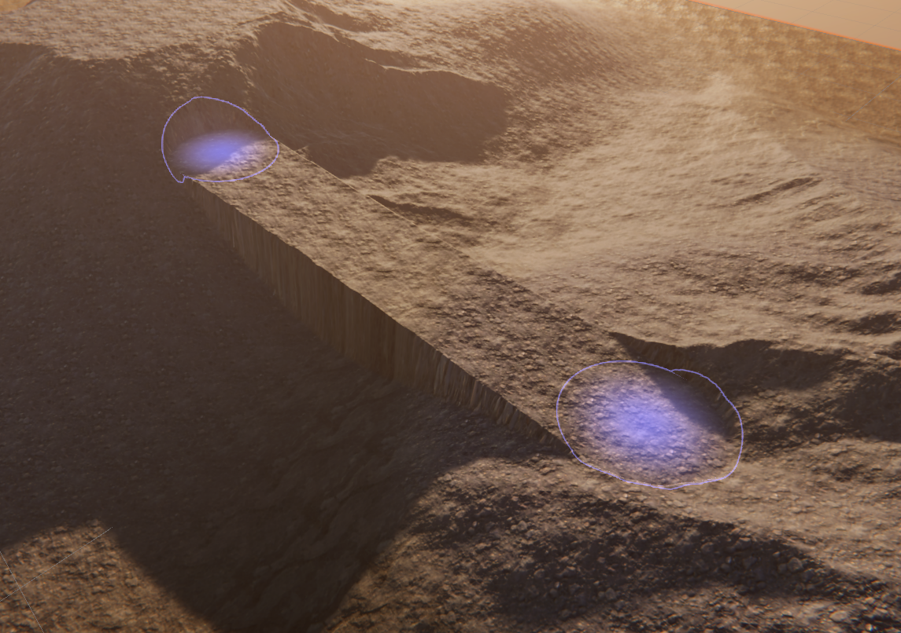

# Bridge Tool

The Bridge Tool lets you build a land bridge on a Terrain by creating a Brush stroke between two selected points.

Select a Terrain tile to bring up the Terrain Inspector. In the Terrain Inspector, click the **Paint Terrain** icon, and select **Sculpt > Bridge** from the list of Terrain tools.

Alternatively, select the terrain, and select the bridge icon on the terrain toolbar.

 

To create a bridge, hold Control and click anywhere on a Terrain tile to select the starting position of the bridge. After you set the starting point, release Control and click anywhere on the Terrain to create a bridge between the set starting point and the point you just clicked. The starting point of your bridge does not change unless you hold Control and click somewhere else on the Terrain tile to assign a new starting point.

## Parameters

!The Bridge Tool control parameters](images/2-11-bridge-02.png)

| **Property**                  | **Description**                                              |
| ----------------------------- | ------------------------------------------------------------ |
| **Width Profile**             | A curve that controls the width along the bridge path. The x-axis represents the percentage along the path, and the y-axis represents the width multiplier. |
| **Height Offset Profile**     | A curve that controls the vertical offset to apply to the height of the bridge path. The x-axis represents the percentage along the path, and the y-axis represents the height offset in world units (meters). |
| **Strength Profile**          | A curve that controls the opacity (strength) of the effect. The x-axis represents the percentage along the path, and the y-axis represents opacity. |
| **Horizontal Offset Profile** | A curve that controls the path in the xz plane for you to build curved paths. The x-axis represents the percentage along the path, and the y-axis represents an offset in world units (meters). |
