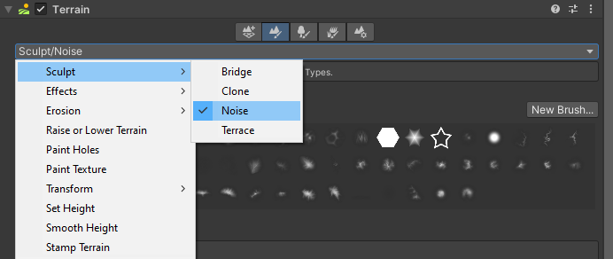
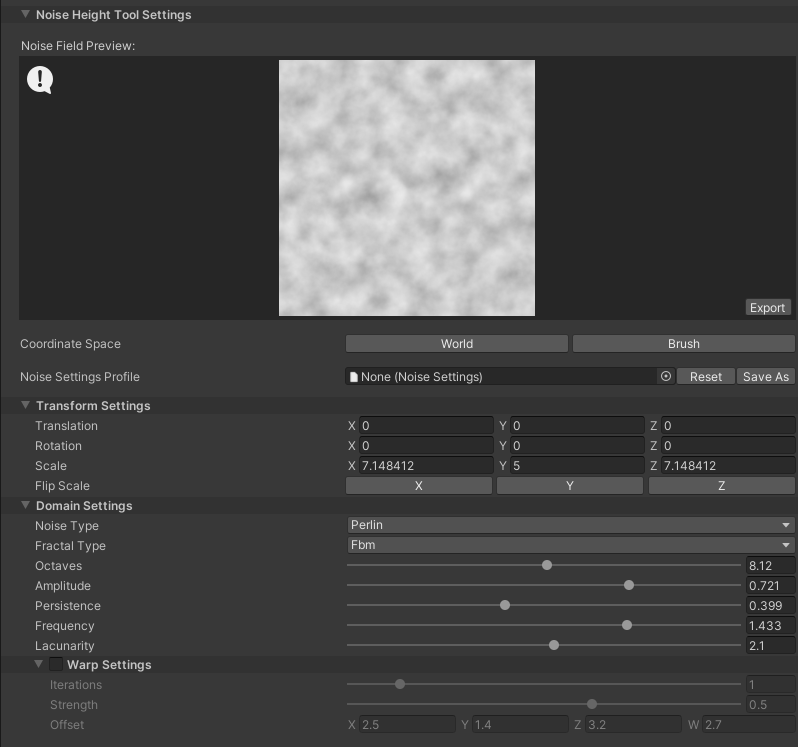
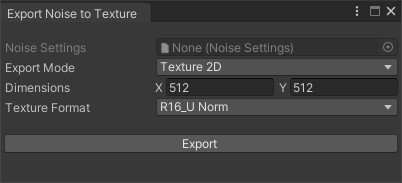

# Noise Height Tool

The **Noise Height Tool** is a paint-and-fill tool that allows you to use different Noise Types and Fractal Types to modify the height of your Terrain. It uses the shaders that the Noise Library generates, and the Tool Shader Generator for the Noise Height Tool.

Select a Terrain tile to bring up the Terrain Inspector. In the Terrain Inspector, click the **Paint Terrain** icon, and select **Sculpt > Noise** from the list of Terrain tools.

**Noise Height Tool Settings** are located at the bottom of the Noise Height Tool window.

## Parameters

### Noise Field Preview

[!include]

### Export

In the Noise Height Tool, the **Export** button is located in the bottom right corner of the **Noise Field Preview**. Click **Export** to open the **Export Noise to Texture** window using the source Noise Settings Asset. It has options for exporting the noise to a Texture.

[!include]

### Coordinate Space

Determines which coordinate space to use for the Noise Height Tool’s paint mode.

| **Property** | **Description**                                              |
| ------------ | ------------------------------------------------------------ |
| **World**    | Click to use the world-space position of the Terrain’s heightmap texel to calculate noise values. Noise values are fixed in world space, and are unaffected by the Brush’s size. |
| **Brush**    | Click to use the Brush-space UV of the current paint operation to calculate noise values. Since the tool performs noise calculations in the Brush-space, the positions it uses are derived directly from the Brush’s local transform, where the center of the Brush is the origin, and the noise-field positions scale with the Brush’s size. |

### Noise Settings Asset

[!include]

### Transform Settings

[!include]

### Domain Settings

[!include]

### Warp Settings
See the [Noise Settings API documentation](../api/UnityEditor.TerrainTools.html) for more information about the actual settings stored in the Noise Settings Asset.

[!include]