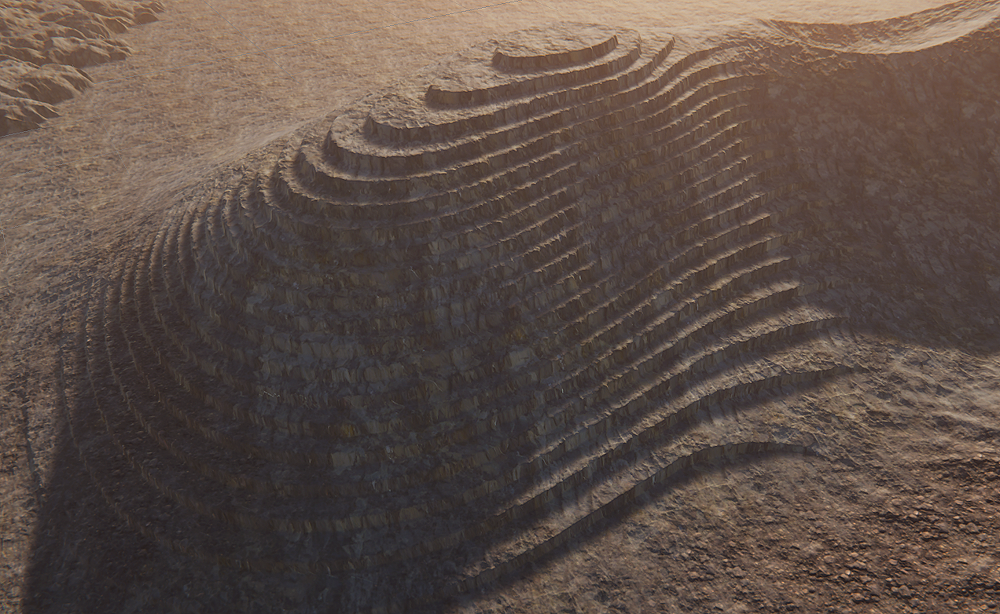
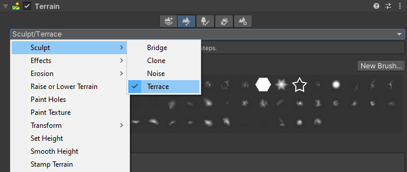

# Terrace Tool

The Terrace tool transforms Terrain into a series of flat areas resembling steps.

To access the Terrace tool, select a Terrain tile to bring up the Terrain Inspector. In the Terrain Inspector, click the **Paint Terrain** icon, and select **Sculpt > Terrace** from the list of Terrain tools.

Alternatively, select the terrain, and select the terrace icon on the terrain toolbar.

 

## Parameters

| **Property**               | **Description**                                              |
| -------------------------- | ------------------------------------------------------------ |
| **Terrace Count**          | Sets the number of terrace steps to create.                  |
| **Jitter**                 | Adds a randomized variation to the terrace count. Increase this value to introduce more variation. |
| **Interior Corner Weight** | Controls how much this tool affects the interior corner of each terrace step. Set to 0 to create horizontal and vertical faces that are perpendicular to each other. Set to 1 to create a sloped transition from the vertical face to the horizontal one. |
