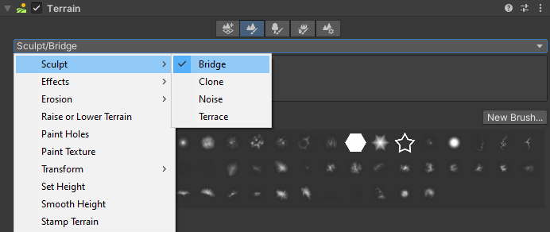

# Sculpt

**Sculpt** is a suite of tools that alter the shape of the Terrain with additive and subtractive methods. **Sculpt** contains four tools:

* [__Bridge__](sculpt-bridge.md) creates a Brush stroke between two selected points to build a land bridge.
* [__Clone__](sculpt-clone.md) duplicates Terrain from one region to another.
* [__Noise__](sculpt-noise.md) uses different noise types and fractal types to modify Terrain height.
* [__Terrace__](sculpt-terrace.md) transforms Terrain into a series of flat areas resembling steps.
