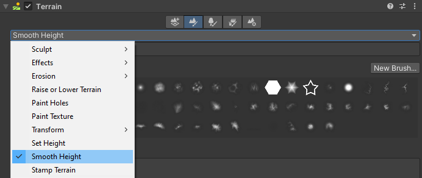
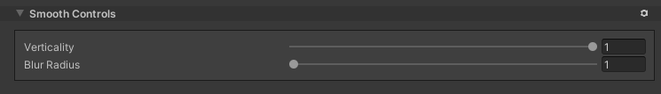

# Smooth Height

Use the **Smooth Height** tool to smooth the [heightmap](https://docs.unity3d.com/Manual/terrain-Heightmaps.html) and soften Terrain features. Smoothing is particularly useful after you paint with brushes that contain high frequency patterns. These brush patterns tend to introduce sharp, jagged edges into a landscape, but you can use the Smooth Height tool to soften that roughness.

**Note:** This tool overrides the built-in [Smooth Height](https://docs.unity3d.com/Manual/terrain-SmoothHeight.html) and adds two new parameters, **Verticality** and **Blur Radius**, which provide finer control when smoothing your Terrain.

To select the Stamp Terrain tool:
1. Select a Terrain tile to bring up the Terrain Inspector. 
2. In the **Terrain Inspector**, click the **Paint Terrain** icon.
3. Select **Smooth Height** from the drop-down menu.

To use the Smooth Height tool, select it and then drag the mouse across Terrain areas that you’d like to smooth. Smoothing the Terrain averages out nearby areas, softening the landscape and reducing the appearance of abrupt changes.

## Parameters

| **Property**    | **Description** |
| --------------- | --------------- |
| **Verticality** | Defines the direction in which to smooth the Terrain. The default value is 0, which smoothens the Terrain toward an average height of the highest and lowest extremities.  **Negative values** Set the value to -1 to smooth the Terrain in a downward direction, or set a value between -1 and 0 to partially smooth it in the downward direction. The lower the **Verticality** value, the more Unity smooths a Terrain in the downward direction.  **Positive values** Set the value to 1 to smooth the Terrain in an upward direction, or set a value between -0 and 1 to partially smooth it in the upward direction. The greater the **Verticality** value, the more Unity smooths a Terrain in the upward direction. |
| **Blur Radius** | Specifies the size of the blurring operation in Texture space. The minimum value of 1 is default, and the maximum value you can set is equal to half of the Terrain's heightmap resolution.  The **Blur Radius** determines the number of texels to include in the blur sample average. Set a larger **Blur Radius** to use a bigger area to sample the Terrain during smoothing.  |
