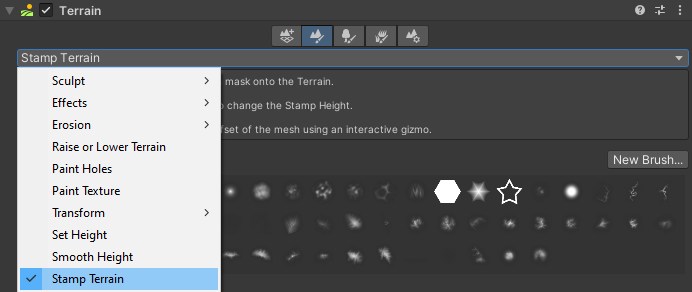
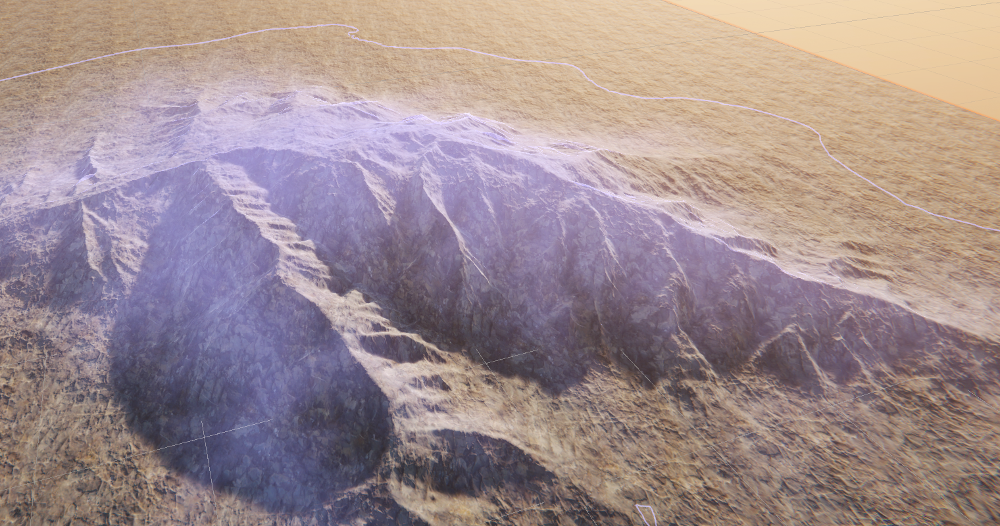
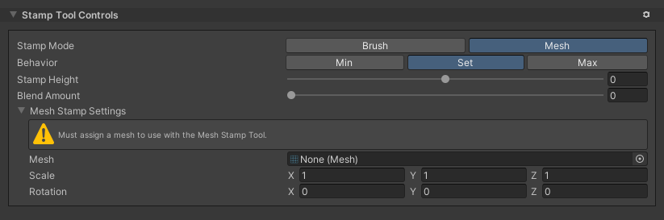

# Stamp Terrain

Use the **Stamp Terrain** tool to stamp a Brush or mesh shape on top of the current heightmap. **Stamp Terrain** lets you apply a Brush with a Texture that represents a heightmap or a three-dimensional mesh. This is useful for creating specific geological features, such as hills, or for placing several precise, regularly-sized topological patterns.

**Note:** This tool overrides the built-in [Stamp Terrain](https://docs.unity3d.com/Manual/terrain-StampTerrain.html) and adds newer features that provide finer control over your Terrain.

To select the Stamp Terrain tool:
1. Select a Terrain tile to bring up the Terrain Inspector.
2. In the **Terrain Inspector**, click the **Paint Terrain** icon.
3. Select **Stamp Terrain** from the drop-down menu.

Select the **Stamp Terrain** tool, set the **Stamp Mode**, and then click on the Terrain. When you click an area with the **Stamp Terrain** tool, it applies the shape of the selected Brush Mask or mesh to the Terrain's heightmap. 

You can use the Stamp Terrain tool’s **Stamp Height** property to make adjustments to how the Stamp Terrain tool applies the Brush Mask or mesh. The Stamp Terrain tool raises or lowers the Terrain by the amount you specify in the **Stamp Height** field. Set a positive **Stamp Height** value to raise the Terrain relative to the height under the cursor, and set a negative value to lower it. If you hold down the C key while in **Mesh Stamp Mode**, an interactive gizmo appears, which you can use to rotate and scale the mesh in Scene view.

Shapes with holes or a lot of concave details don't work well as mesh stamps. This is because Unity’s Terrain system is heightmap-based, and only the widest section of a convex mesh projects into the heightmap. Details you create in the heightmap using the stamp are based on the Terrain's resolution, and not the vertex density of the assigned mesh.

## Parameters

| **Property**            |               | **Description**                                                             |
| ----------------------- | ------------- | ----------------------------------------------------------------------------|
| **Behavior**            |               | Sets the mode to use when you apply a stamp to the existing Terrain. |
|                         | **Brush**     | Applies the selected Brush Mask to the stamp. |
|                         | **Mesh**      | Applies the selected mesh to the stamp. |
| **Behavior**            |               | Specifies how the stamp relates to the existing Terrain. The default behavior is **Set**. |
|                         | **Min**       | Applies the stamp only where it lowers the Terrain. Areas under the stamp that are lower than the **Stamp Height** value remain unchanged. |
|                         | **Set**       | Applies the stamp without referencing the height of the underlying Terrain. |
|                         | **Max**       | Applies the stamp only where it raises the Terrain. Areas under the stamp that are higher than the **Stamp Height** value remain unchanged. |
| **Stamp Height**        |               | Sets the height of the stamp relative to the position of the cursor. You can see the offset in the Brush preview. While the tool is active, you can also scroll with the mouse wheel to adjust the stamp height.  The default value is 100, and you can set **Stamp Height** to any value between -600 and 600. |
| **Blend Amount**        |               | Defines how much to retain or override existing Terrain features under the stamp.  The default value is 0, which applies the stamp while overriding existing Terrain features under the active Brush Mask shape. Set the value to 1 to apply the stamp while maintaining the Terrain features under it. Set a value between 0 and 1 to partially maintain Terrain features under the stamp. |
| **Mesh Stamp Settings** |               | Only appear when you set the **Stamp Mode** to **Mesh**. These settings let you set the mesh as well as scale and rotate the imported mesh. |
|                         | **Mesh**      | The mesh to stamp on the Terrain. |
|                         | **Scale**     | Changes the size of the mesh stamp. While in the Scene view, hold down the C key and select any of the cubes on the gizmo to edit these values. |
|                         | **Rotation**  | Changes the rotation of the mesh stamp. While in the Scene view, hold down the C key and select any of the axes of the wireframe sphere gizmo . |