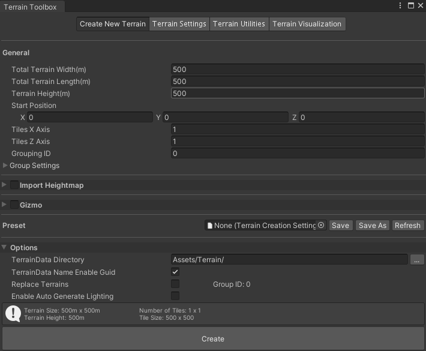

# Creating Terrain

The **Create New Terrain** wizard in the Terrain Toolbox lets you create a new multi-tile Terrain, and set Terrain size and settings upfront. It also allows you to create new Terrain from an imported RAW heightmap, or a series of heightmaps.

