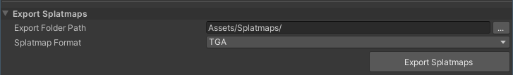

# Export Splatmaps

The **Export Splatmaps** tool lets you export splatmaps into textures in either the TGA or PNG format. This allows you to use the splatmap textures elsewhere, or edit them using external graphics editing software. Later on, you can use the **Replace Splatmaps** tool to import any edited splatmaps.

| **Property**           | **Description**                                              |
| ---------------------- | ------------------------------------------------------------ |
| **Export Folder Path** | The directory path to save splatmap textures to.             |
| **Splatmap Format**    | Select either TGA or PNG as the output format.               |
| **Export Splatmaps**   | Click this button to export splatmaps from selected Terrain in the Scene or Hierarchy. |
