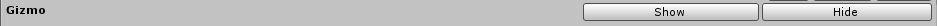
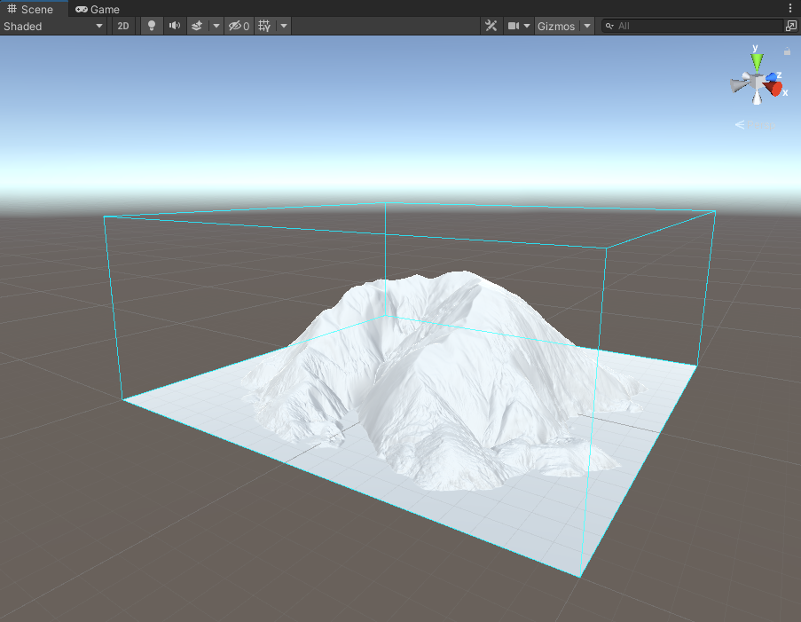

## Gizmo

The **Gizmo** is a transparent cube that appears in Scene view to help identify the location and scale of the Terrain. Click the **Show** button to display the Gizmo, and click the **Hide** button to remove it.

_Gizmo displayed in Scene view_

