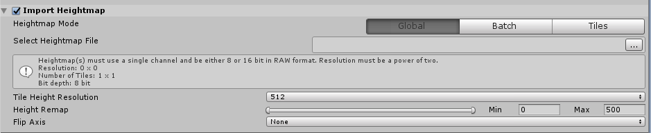
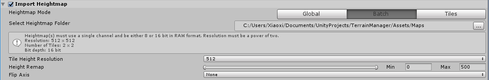
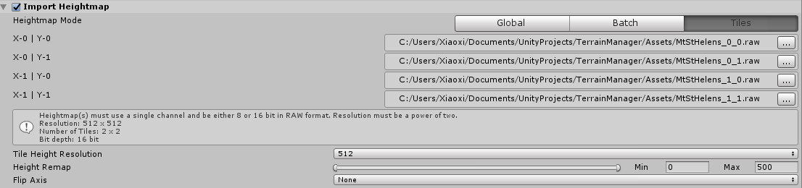
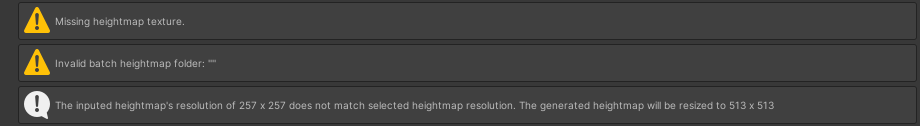
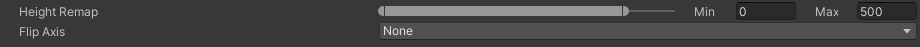

# Import Heightmap

The **Create New Terrain** wizard has an **Import Heightmap** section, which lets you import a heightmap or a series of heightmaps for creating new Terrain. Click the checkbox on the expander menu to enable this option.

## Import modes

Heightmaps must be in the RAW format, and the size of each heightmap must be a power of two. There are three import modes: **Global**, **Batch**, and **Tiles**.

### Global

**Global** mode lets you import one heightmap for use on all Terrain tiles. There are two options for the heightmap format.

By default, you can select a single channel heightmap from the project in the Texture field.

The second option is to enable the **Use Raw File** checkbox, which lets you select a RAW file heightmap texture to use.

### Batch

**Batch** mode lets you import a list of heightmaps, and applies one heightmap per tile. Provide the folder path where heightmaps reside. The Toolbox then imports each heightmap, and automatically assigns them to the respective tiles. For auto-assignment to work, you must name the heightmaps properly.

Heightmap filenames must end with two index digits — the index along the X axis, and the index along the Z axis. For example, `MtStHelens_0_0`, `MtStHelens_0_1`, `MtStHelens_1_0`, and `MtStHelens_1_1` creates a 2 x 2 tiled Terrain comprising the four heightmaps. The heightmap files look like this in file explorer.

### Tiles

**Tiles** mode lets you assign a heightmap manually to each tile slot, and there are no file naming requirements.

## Information and warning boxes

The information and warning boxes inform you if there is missing data, or if the selected Texture settings differ from that of the Terrain.

## Heightmap settings

| **Property**               | **Description**                                              |
| -------------------------- | ------------------------------------------------------------ |
| **Height Remap**           | Remaps the 0 and 1 values of the heightmap to minimum and maximum Terrain heights. |
| **Flip Axis**              | Flips the axis horizontally or vertically, or does not flip them. |
