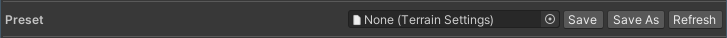

# Preset

Similar to **Preset** in the Create New Terrain wizard, you can save the current settings or load settings using a preset asset file. Preset files make it easy to share settings with other team members.

| **Property**               | **Description**                                              |
| -------------------------- | ------------------------------------------------------------ |
| **Save**                   | Saves the current settings to the selected preset file. Creates a new preset file if it doesn't exist. |
| **Save As**                | Saves the current settings into a new preset file. |
| **Refresh**                |  Reloads settings from a selected preset file. |
