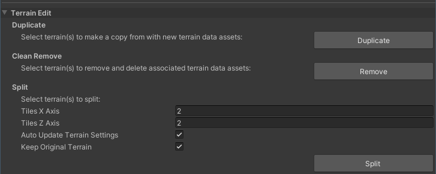
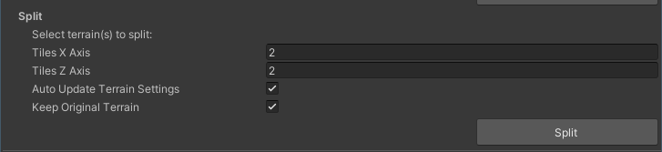

# Terrain Edit

The **Terrain Edit** section contains three tools — **Duplicate**, **Clean Remove**, and **Split**.

## Duplicate

The **Duplicate** tool copies selected Terrain in the Scene or Hierarchy, and also copies the associated Terrain data asset files. By doing so, the duplicated Terrain does not share the same Terrain data assets with the source Terrain, which allows you to edit the duplicates without modifying the original Terrain.

To start the copy process, select your source Terrain in the Scene or Hierarchy, and click the **Duplicate** button. You cannot undo this process.

## Clean Remove

**Clean Remove** lets you delete selected Terrain in the Scene or Hierarchy, and also delete the corresponding Terrain data asset files.

To start the clean remove process, select your target Terrain in the Scene or Hierarchy, and click the **Remove** button. You cannot undo this process.

## Split

The **Split** tool lets you divide Terrain into smaller tiles while properly preserving Terrain height, Terrain Layers, and other details. 

| **Property**                     | **Description**                                              |
| -------------------------------- | ------------------------------------------------------------ |
| **Tile Split**                   | The number of tiles along the X and Z axes after the split.  |
| **Auto Update Terrain Settings** | Enable the checkbox to copy settings from the original Terrain. Disable the checkbox to use default Terrain settings on the new tiles. |
| **Keep Original Terrain**        | Enable the checkbox to keep a copy of the original Terrain even after the split. Disable the checkbox to remove the original Terrain after the split. |

After you configure these settings, click the **Split** button to divide the selected Terrain in the Scene or Hierarchy.