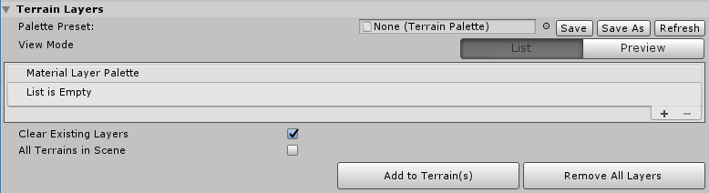
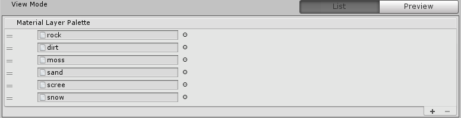
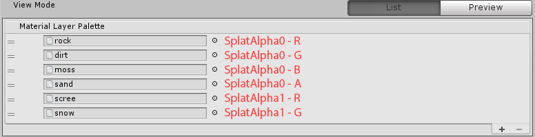
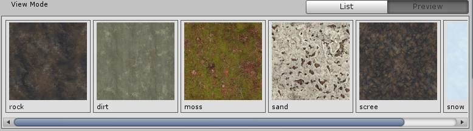

## Terrain Layers

The **Terrain Layers** section contains a few tools to help manage Terrain Layers on Terrain.

### Terrain Palette

A Terrain Palette is a preset Asset file that stores a collection of Terrain Layers. This preset file is similar to other Toolbox presets, which you can save or share.

### Palette View

You can view the Layer Palette as either a reorderable list, or as a list of preview thumbnails. In **List** view, you can add, remove, or reorder layers.

*Layer Palette in List mode*

Use the Add (**+**) and Remove (**-**) buttons on the bottom right to add or remove a layer. Alternatively, drag a layer row, and move it up or down to change its position in the list.

You cannot add more than eight layers because the Editor currently only supports up to two splatmaps, which implies a maximum of eight channels. Each channel contains information for one Terrain Layer. Thus, the list order affects which channel and splatmap a layer uses. For example, the image below shows the respective splatmap and channel each layer uses when you assign them to a Terrain.

*Layer Palette in Preview mode*

**Preview** mode is convenient if you want to see the texture of each layer. However, you cannot edit or reorder layers in this mode.

### Edit Layers

When you are done configuring the Layer Palette, click **Add to Terrain(s)** to add the layers to Terrain in the Scene.

| **Property**              | **Description**                                              |
| ------------------------- | ------------------------------------------------------------ |
| **Clear Existing Layers** | Enable this checkbox to remove any existing layers on the Terrain before adding new layers from the palette. |
| **All Terrains in Scene** | Enable this checkbox to apply changes to all Terrain in the Scene. Disable this checkbox to apply changes only to selected Terrain in the Scene. |
| **Add to Terrain(s)**     | Add palette layers to Terrain.                               |
| **Remove All Layers**     | Remove all layers from Terrain.                              |