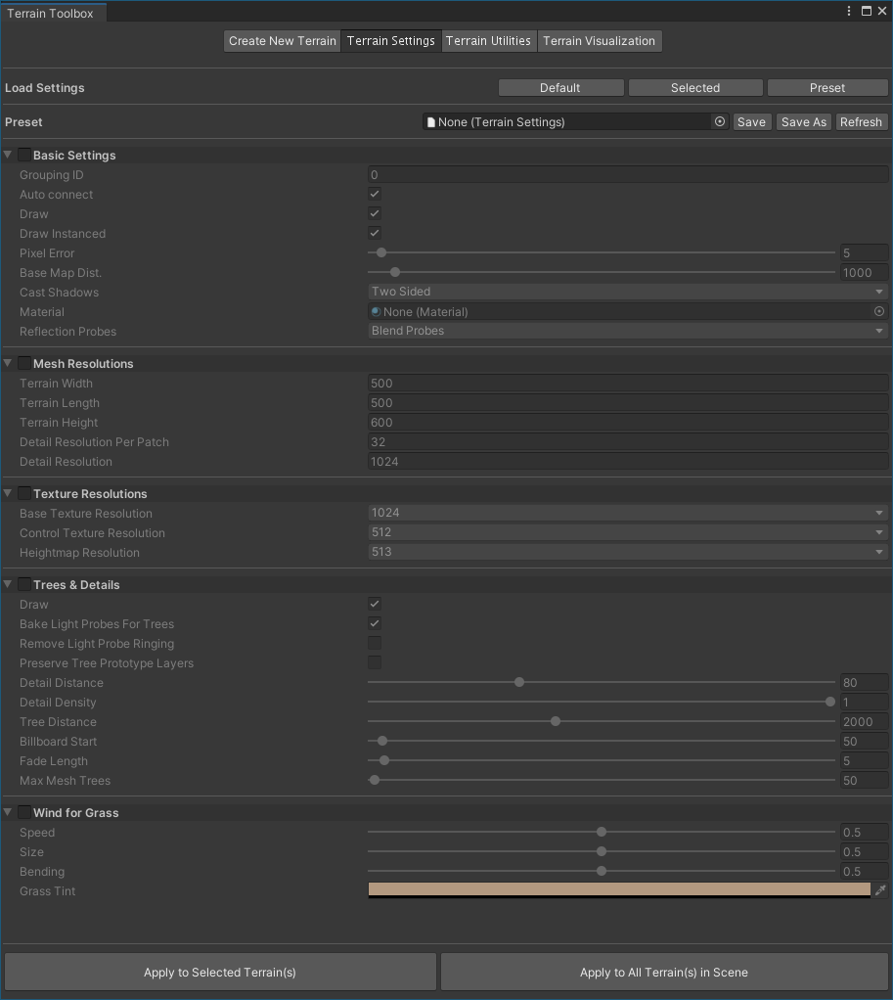

# Terrain Settings

The **Terrain Settings** wizard lets you modify Terrain settings simultaneously for multiple Terrain tiles, and save your settings in a preset asset file. You can also load settings from existing preset asset files.

Previously, to change Terrain settings for multiple Terrain tiles in the Editor, you had to select each tile, and make the changes one tile at a time. **Terrain Settings** in the Toolbox eases this process.

