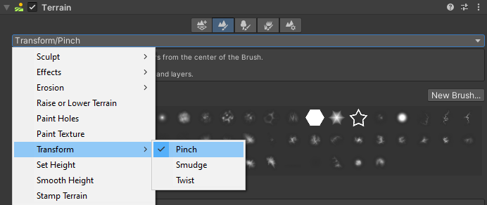

# Transform

**Transform** is a suite of tools focused on translating the Terrain. **Transform** contains three tools:

* [__Pinch__](transform-pinch.md) pulls the height towards or bulges it away from the center of the Brush.
* [__Smudge__](transform-smudge.md) moves Terrain features along the path of the Brush stroke.
* [__Twist__](transform-twist.md) rotates Terrain features around the center of the Brush, along the path of the Brush stroke.
